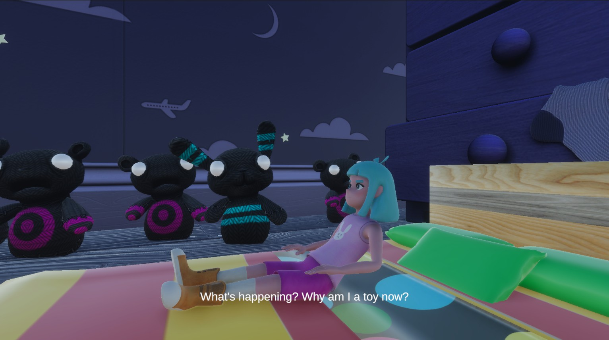

### IF3210-2023-Unity-BGS

# Tugas Besar 2 - Unity - PBD

> Oleh Kelompok BGS (Bebas Game Studio)

## Deskripsi Aplikasi

Extended Survival Shooter merupakan game bertema survival shooting. Pada game ini, pemain dapat menjalankan quest berdasarkan story yang disajikan untuk mencapai score terbaik. Untuk menjalankan quest tersebut, pemain memiliki beragam jenis weapon, pet, shopkeeper, cheat, dan fitur untuk menyimpan dan me-load permainan.

## Library yang Digunakan

-   TMPro: library UI

## Screenshots Tampilan Game

### Main Menu

### Cutscenes

### Gameplay

## Pembagian Tugas Kelompok

-   William Manuel Kurniawan (13520020)

    -   \*Sedang sakit dan dirawat di rumah sakit

-   Raden Haryosatyo Wisjnunandono (13520070)

    -   Mengembangkan Pet: Healer
    -   Mengembangkan Pet: Attacker
    -   Mengembangkan Pet: Aura Buff
    -   Mengembangkan Quest 4 - Boss Fight
    -   Mengembangkan Cheat
    -   Melakukan integrasi code
    -   Melakukan review dan debug terhadap code

-   Eiffel Aqila Amarendra (13520074)

    -   Melakukan setup Agate Survival Shooter
    -   Mengembangkan Shopkeeper
    -   Mengembangkan Local Scoreboard
    -   Mengembangkan Quest 1
    -   Mengembangkan Quest 2
    -   Mengembangkan Weapon: Upgrade
    -   Mengembangkan Game Over Screen
    -   Mengembangkan Cheat
    -   Melakukan integrasi code
    -   Melakukan review dan debug terhadap code

-   Febryola Kurnia Putri (13520140)

    -   Merancang Story Mode (Jalan Cerita beserta Quest terkait)
    -   Mengembangkan Cut Scene: Opening Scene
    -   Mengembangkan Cut Scene: Scene Tambahan (Sebelum Boss Fight)
    -   Mengembangkan Cut Scene: Ending Scene
    -   Mengembangkan Main Menu
    -   Melakukan integrasi code
    -   Melakukan review dan debug terhadap code

-   Zayd Muhammad Kawakibi Zuhri (13520144)

    -   Mengembangkan Weapon: Default
    -   Mengembangkan Weapon: Shotgun
    -   Mengembangkan Weapon: Sword
    -   Mengembangkan Weapon: Bow
    -   Mengembangkan Quest 3
    -   Mengembangkan Save dan Load Game
    -   Melakukan integrasi code
    -   Melakukan review dan debug terhadap code

## Jumlah Jam Persiapan dan Pengerjaan

-   William Manuel Kurniawan: \*Sedang sakit dan dirawat di rumah sakit

-   Raden Haryosatyo Wisjnunandono: 120 jam

-   Eiffel Aqila Amarendra: 120 jam

-   Febryola Kurnia Putri: 120 jam

-   Zayd Muhammad Kawakibi Zuhri: 120 jam
